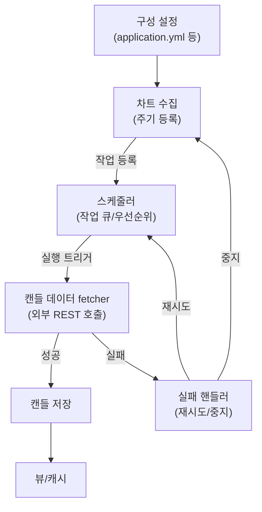

Tratic
=====================================

차트 기반 매매일지 분석 앱

### 차트 수집

가상화폐 거래소(Upbit)의 데이터(시총이 큰 코인 위주)을 주기적으로 수집  
주식에 비해 차트의 영향력이 더 크다 판단해 정량적 분석의 가치가 더 있을 것으로 봄  
추후에 차트 그리는 기능 추가 시 실시간 수집

### 매매 일지 분석

차트에서 계산 가능한 정량적인 보조 지표(atr, adx 등)를 통해 거래의 경향성 및 적합도를 분석  
거래에 사용된 프레임(분봉)을 평가 기준으로 삼고 상위 프레임(4시간봉, 일봉 등)을 보조 가중치로 사용 

  

## 구조

### 차트 수집
 

모든 캔들에 대해 같은 주기 수집으로 처리  
거래소별 API 제한 스케줄러에서 관리  
WebSocket 붙이고 싶으면 실시간 데이터는 따로 쓰고 캔들 완성되는 순간에 단일 작업을 스케쥴러에 전달해서 처리 
